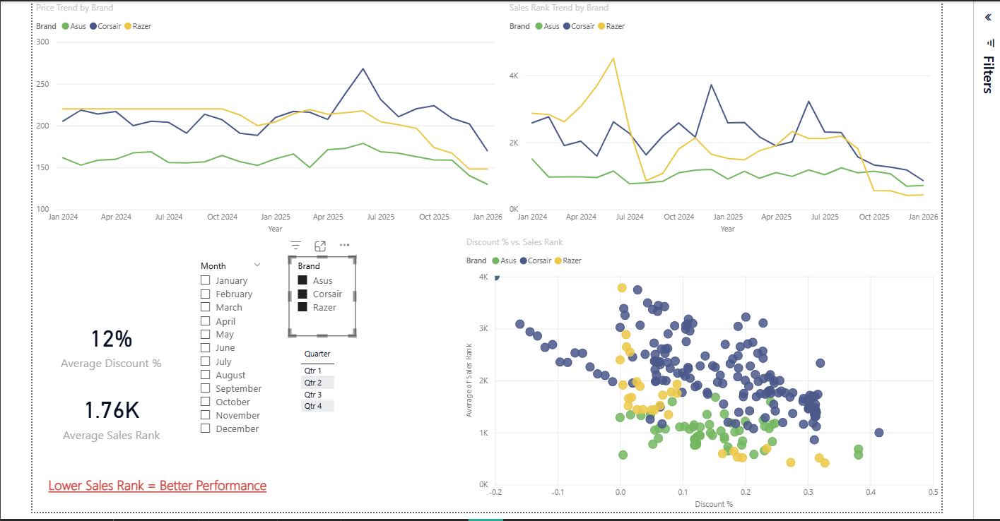
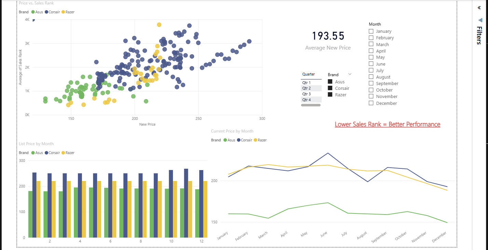

# Amazon Gaming Keyboard Analysis | Power BI

A university learning project where I used **Power BI** to explore historical Amazon product data for three gaming keyboards from **Asus, Corsair, and Razer**.

The project focuses on pricing, discounts, Sales Rank trends, and basic forecasting. The goal was to practice an end-to-end BI workflow rather than build a production analytics system.

> **Note:** A lower Amazon Sales Rank indicates better relative performance.

## At a Glance

**Selected 3 comparable gaming keyboards → collected historical Amazon data with Helium 10 → cleaned and prepared it in Power BI → built interactive dashboards → analyzed pricing, discounts, Sales Rank, and seasonality → experimented with basic forecasting → translated the results into meaningful business insights while documenting the limitations.**

---

## Dashboard Preview

### Sales Rank

### Discount Analysis

### Pricing Analysis

### Sales Rank Forecast

#### Asus

#### Corsair

#### Razer

---

## Project Goal

For this project, I had flexibility in choosing the dataset and use case.

I chose three gaming keyboards from different brands — **Asus, Corsair, and Razer** — while keeping them within the same product category and a similar price range.

The idea was to make the comparison more meaningful by reducing major differences in product type and price level, then explore how factors such as pricing, discounts, and time were associated with product performance.

This allowed me to focus on questions such as:

- How does Sales Rank change over time?
- How are price and Sales Rank related?
- How does discounting relate to Sales Rank?
- Do the three brands behave differently under similar conditions?
- Are there noticeable monthly or seasonal patterns?

The dashboard was designed as a simple decision-support tool for product-level pricing, promotion, and stock decisions.

It was mainly intended for product managers, category managers, and retail decision-makers who want a simple way to compare similar products and explore historical performance.

---

## Data

Historical Amazon product data was collected using **Helium 10**.

The raw Helium 10 exports were simple historical product snapshots containing four main fields:

- Time
- Sales Rank
- New Price
- List Price

I collected separate datasets for the three keyboards and then cleaned and prepared them in Power BI.

The records represent historical product snapshots rather than individual sales transactions, meaning they show how metrics such as price and Sales Rank changed over time but do not provide actual units sold or revenue.

---

## Data Preparation

I used **Power Query** to prepare the data.

The main preparation steps included:

- cleaning and checking data types
- combining the three product datasets
- adding a Brand identifier
- creating Year, Month, and Year-Month fields
- creating a Discount % field

The discount calculation used was:

`(List Price - New Price) / List Price`

Because of this formula, negative values can appear when the observed New Price is higher than the List Price.

---

## Power BI Analysis

The final report contains four pages:

1. **Sales Rank**
2. **Discount**
3. **Prices**
4. **Sales Rank Forecast**

I also created measures for metrics such as:

- Average Sales Rank
- Average Discount %
- Total Months Analyzed

Interactive slicers allow the report to be explored by brand and time period.

---

## Key Observations

Some patterns that appeared in the historical data were:

- **Asus generally showed lower Sales Rank values** and lower pricing during much of the observed period.
- Lower prices were generally **associated with better Sales Rank values**.
- **Razer showed noticeable changes in Sales Rank around discounting and promotional periods.**
- Some stronger Sales Rank periods appeared around end-of-year months.

These are observational relationships.

They do **not** prove that price or discounts directly caused changes in Sales Rank.

---

## Business Takeaways

Based on the historical patterns, the dashboard can support discussions around:

- comparing which products showed stronger or more stable historical performance
- reviewing pricing and discount strategies
- planning promotions around periods that historically showed stronger performance
- considering historical performance when making stock-prioritization decisions

These should be treated as **decision-support ideas rather than strict business recommendations**, since the dataset does not include every factor that can affect product demand.

---

## Forecasting

I also experimented with **Power BI's built-in forecasting feature** using monthly Sales Rank data.

The forecast used:

- a **6-month forecast horizon**
- **12-month seasonality**
- a **95% confidence interval**

I consider this an **exploratory forecasting exercise**, not an advanced predictive model.

A more advanced version could be built in Python using dedicated statistical or machine-learning time-series methods, proper train/test validation, forecasting error metrics, and comparisons between multiple models.

The confidence intervals also become quite wide in some cases, so the forecasts should be treated as general guidance rather than exact predictions.

---

## Limitations

This project has several important limitations:

- **Sales Rank is not the same as units sold.**
- The dataset does not contain actual transaction-level sales volume.
- Sales Rank is used only as a proxy for relative product performance.
- The dataset does not include factors such as inventory levels, advertising, customer reviews, competitor activity, or marketing spend.
- Relationships between price, discounts, and Sales Rank are observational, not causal.
- The Power BI forecast is relatively simple and depends heavily on historical patterns continuing.
- The project was created for learning as part of a university course, not as a production business intelligence system.

---

## Tools Used

- **Power BI**
- **Power Query**
- **DAX**
- **Helium 10**

---

## What I Practiced

Through this project I practiced:

- collecting and understanding product data
- cleaning and transforming data
- combining multiple datasets
- Power Query
- DAX
- dashboard design
- data visualization
- exploratory business analysis
- translating data into business-oriented observations
- basic forecasting in Power BI
- recognizing limitations in analytical conclusions

---

## Power BI File

The complete Power BI report is available here:

[Download the PBIX file](Amazon-Gaming-Keyboard-Analysis.pbix)

---

## Project Context

Originally developed for a **Business Process Support** university assignment and later cleaned and documented for my portfolio.
